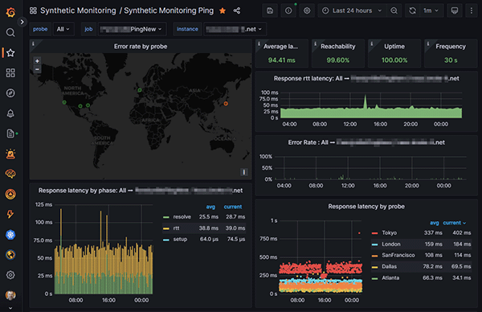
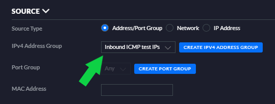
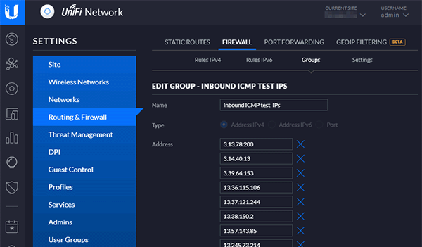
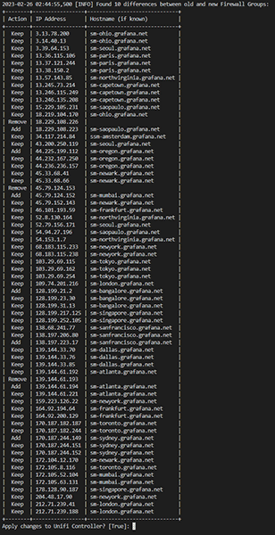

Unifi Firewall Group REST Updater
============================
This script is designed to automate the management of Firewall Groups on Ubiquiti Unifi controllers. That can be a challenge when managing multiple lists, lists of IPs are long, or you'd like to automate DNS lookup and push to a Unifi Controller. It works for any source of IP's and Unifi Firewall Group, not just the Grafana Cloud example below.

TLDR: What it Does
-------------------
1. Give it the following details:
    * Path to a file with a list of source hostnames to add to a Unifi Firewall Group
    * Alphanumeric ID of the Firewall Group to update
    * Unifi Controller connections details (path, user, password)
2. The script will then:
    * Lookup all the DNS 'A' records for each host in the host file
    * Create and de-dupe a list of IP's to push to the Unifi Controller
    * Connect and pull the current list of IPs from the controller
    * Optionally display the change diff and confirm before the update
    * Update the Unifi Controller's indicated Firewall Group with the new IP list

But Why?
--------
Unifi networking is a powerful prosumer or small enterprise option, offering easy-ish configuration and solid cost/performance. It offers Software Defined Networking (SDN)-like GUI management for Unifi devices adopted by Unifi controllers. The challenge is that while Unifi hardware can also offer advanced features, they are poorly documented. Automation in particular is non-trivial to configure.

In my case I try to keep my home network as close to invisible to the internet as possible. No port forwarding, inbound requests like webhooks only via tunneling, no socket-based VPN service to TCP sweep, and inbound PING is dropped. But that last objective is tricky if you also want to see beautiful Grafana synthetic reachability dashboards like this:

[](images/grafana-ping-dashboard.png)
<br>*Image: Grafana Cloud Synthetic ICMP Monitor Dashboard* (click to embiggen)

There's Always a But
--------------------

To make that work, you must create two Unifi Firewall Rules. One to drop all incoming ICMP packets, and the other a specific WAN Local rule to explicitly allow ICMP for the host IP list of Grafana Cloud (or your synthetic test site of choice). 

The challenge becomes weekly to daily management of the IP lists. To do that means manually clicking "Edit" on the Unifi ICMP allow firewall group and editing the IPs required for the long list of Grafana Cloud Synthetic test probes. Eventually that gets old, and ignored, and I start seeing Sev 1 "WAN Down" alerts from Grafana. 

The first part is easy, configure the rule, then create a Firewall Group in the Unifi web console. **Note that this guide uses the "Legacy" Unifi web interface, use whichever you prefer**:


<br>[*Image: Unifi Firewall Rule Source Config*] 

And here's a truncated Firewall Group Edit screen. Click to see the full-length list.

[](images/unifi-group-detail.png)]
<br>*Image: Unifi Firewall Group List* (click to embiggen)

While that works for small, static lists, I had to automate maintaining that list because:
1. Any change to an IP can break Grafana tests and alerting
2. There are dozens of them 
3. They can change daily without notice
4. Manually maintaining this gets old in hurry

Grafana is the Source File "But" (For Now)
------------------------

Although specific to this use, there's a reason this script isn't completely automated, and why you can use it for sourcing from any host list, not just this use-case. While Grafana Cloud makes all their other whitelists available as JSON URLs, the lists of Synthetic Monitoring hosts is only available by scraping their website. I'm periodically scraping [https://grafana.com/docs/grafana-cloud/reference/allow-list](https://grafana.com/docs/grafana-cloud/reference/allow-list) and copy-pasta into a file, in this case `grafana-synthetic-probes.txt`. You can use whatever file(s) you like, and if you know to use the `click` module to pipe in a string list on the command line, please feel free to contribute. 

Automate and Share
------------------
And so, this script. It's a quick hack, but you're sure to find many more uses for it than automated PING whitelist management. Create the host file however you like, set up a job to call the script, and test for exit code 0. It implements a logger, so you can redirect output to your Observability Platform of Choice.

If you want to manually run it, it includes an interactive mode which will prompt you for the details it needs. It also confirms the host list file path before starting.

How to Use 
=====================
Installation
-------------------
Switch to a directory where you want to put the script, then pull the repo:
```
$ git clone https://github.com/ferventgeek/unifi-firewall-group-updater
``` 
or
```
wget https://github.com/ferventgeek/unifi-firewall-group-updater.git
```
etc.

A `pip` installer would be nice, but I capped work on this to three hours. However, you can install from the `requirements.txt` file or one at a time. Feel free to update `requirements.txt`. Old modules get security musty.

```
pip install -r requirements.txt
```

Get the Firewall Group ID From Your Unifi Web Console
-----------------------------------------------------

For the script to work, it will need the hex ID of the Unifi Firewall Group you want it to manage.
1. Open the Unifi web console and go to<br/> `Settings 🠚 Routing & Firewall 🠚 Firewall 🠚 Groups`
1. In the list of groups click "Edit" for the group you want to automatically manage with this script. 
1. Copy the alphanumeric ID of the selected Firewall Group after the last `/` in the browser URL. It will look similar to this:<br/>`https://{host}/manage/site/default/settings/firewall/groups/edit/402150ab88c62b048130c38a` where `402150ab88c62b048130c38a` is the Firewall Group. (The script will use that to match the `_id` property in Unify Controller REST JSON.)

Command Line or Interactive?
----------------------------

You have two options when using the script, interactive and command line.

For interactive mode, run the script without arguments and it will prompt you for configuration details.

```
$ uc-firewall-group-update.py
```

However, most users will use the command line option, passing in the required properties as arguments:

```
$ uc-firewall-group-update.py --unifihostpath=https://192.168.1.4:8443 \
    --user={username} \
    --password={yourpassword} \
    --groupid={your firewall group ID from above} \
    --hostfile=grafana-synthetic-probes.txt
```
You can specify any source file you like, making it easy to swap out Group lists at runtime.

If you'd like to securely automate the script, simply call it as above but omit the `--password={yourpassword}` argument. Then it will only prompt you for your password, then run. (The password is hidden and asks for confirmation before proceeding.)

You can also view help with the `--help` argument.

```
$ uc-firewall-group-update.py --help
Usage: python -m uc-firewall-group-update [OPTIONS]

Options:
  --unifihostpath TEXT            Full URL to the Unifi Controller including  
                                  protocol, host, and port (if required). For 
                                  example the default is
                                  "http://{hostname|IP}:8443". Use "https://" 
                                  if SSL is enabled.
  --user TEXT                     Username for the Unifi Controller
  --password TEXT                 Password for the Unifi Controller
  --groupid TEXT                  Unifi firewall group ID to update. To find  
                                  it, log into the Unifi Controller, click    
                                  "Edit" for the group to update, and copy the
                                  alphanumeric group ID from the end of the   
                                  URL in the browser.
  --hostfile PATH                 Path to the input file containing the list
                                  of hostnames for DNS lookup and update into
                                  the Unifi Controller for the Firewall Group
                                  ID specified by "groupid"
  --confirm BOOLEAN               Asks to confirm the update before
                                  proceeding, default=True. For silent update
                                  set to false
  --loglevel [DEBUG|INFO|WARNING|ERROR|CRITICAL]
                                  Sets the log level
  --help                          Show this message and exit.
  ```
  Confirmation Option
  -------------------
  If `--confirm=False` is not specified, the script will halt and display an `Apply changes to the Unifi Controller? [TRUE]` prompt. Confirm is the default behavior. **If you are running the script on an automated schedule please make sure you set `--confirm=False` or it will halt**. And you'll shake your fist at the MIT license's lack of support.

  However, confirm includes a neat little treat with the default `--confirm=True`: a diff of the changes that will be made on the Unifi Controller.

  [](images/diff-output-confirm.png)]
<br>*Image: Firewall Group List diff View* (click to embiggen)

Have fun
==========
Hopefully you'll find a use for this Unifi automation script. It's saving me a ton of time and fat-finger troubleshooting heartache. It should be part of a larger management platform module, but then it would still be sitting on a local drive.

I'm old to code but new to Python. I'd love your feedback and will help as I'm able.

  
